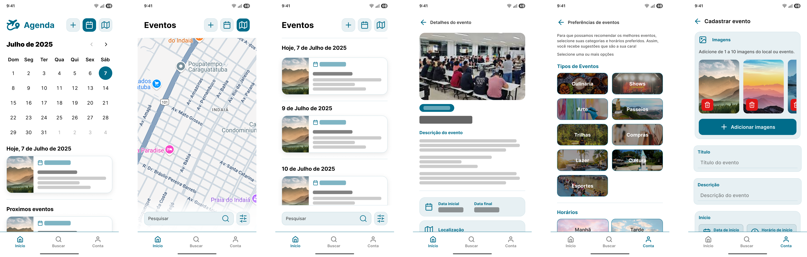

  

<h1 align="center">Hackathon 2025 - Obelisco da Torneira</h1>

  <strong>Projeto desenvolvido durante o Hackathon 2025, realizado no IFSP Câmpus Caraguatatuba</strong> 
  <em>Calendário integrado de eventos culturais, educacionais e turísticos</em>

---

## 📌 Proposta do Desafio

Atualmente, o município de Caraguatatuba não possui um canal unificado e confiável para centralizar informações sobre eventos culturais, educacionais e turísticos. As informações são divulgadas de forma dispersa, dificultando o acesso da população e dos visitantes a uma agenda atualizada.

**Desafio:**  
Criar um calendário digital colaborativo e confiável, onde entidades credenciadas possam divulgar seus eventos e o público possa consultar e receber informações personalizadas conforme seus interesses.

---

## 💡 Solução Desenvolvida

A equipe **Obelisco da Torneira** propôs uma plataforma que:

- Permite a publicação eventos de forma padronizada;
- Oferece um canal centralizado para consulta dos eventos;
- Personaliza as recomendações de eventos com base nas preferências do usuário;
- Valoriza a experiência tanto de moradores quanto de turistas.

---

## 📂 Documentação e Protótipo

📄 [Acessar a Documentação do Projeto](Documentação.pdf)  
🎨 [Ver o Protótipo no Figma](https://www.figma.com/design/h3Mh9DLIKKCU7EjHwqzmqE/Prot%C3%B3tipo?node-id=1-2&p=f&t=mMn2yyTWq24kdegs-0)
